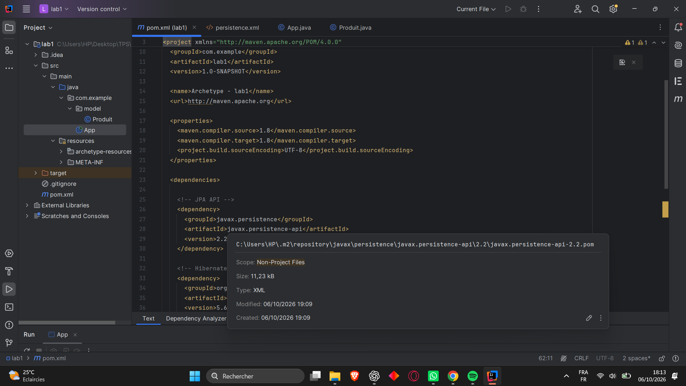
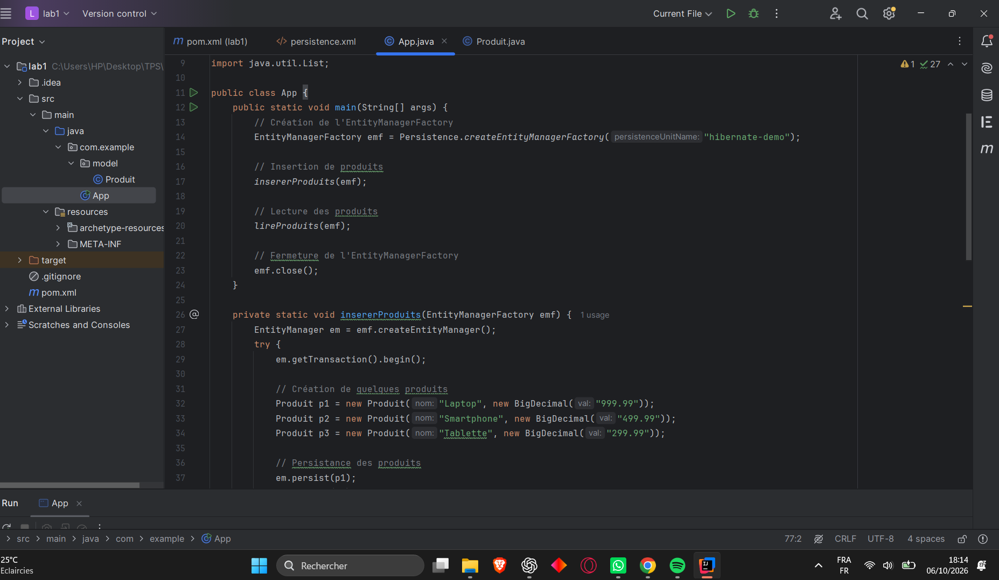
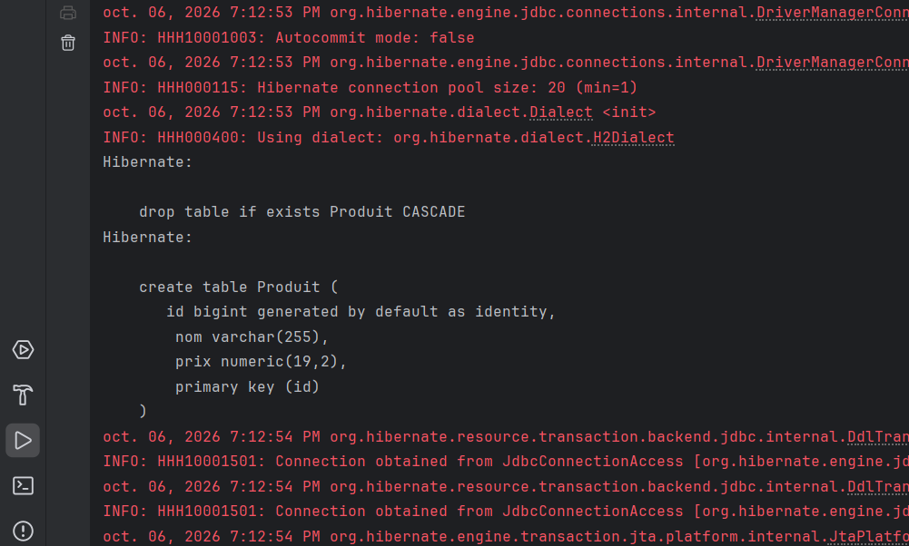
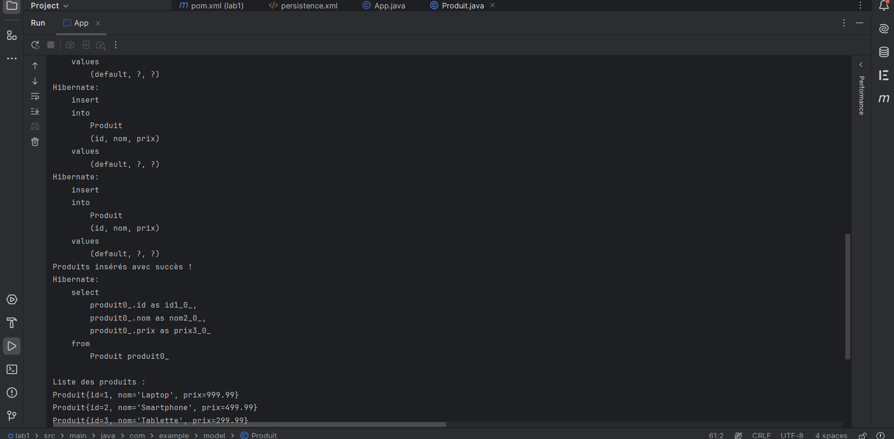
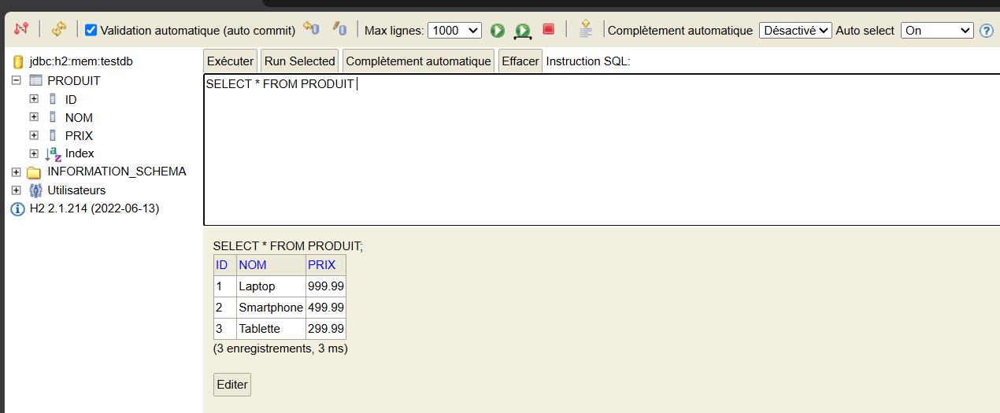

# Lab 1 - JPA, Hibernate & H2

## Objectif

Ce TP consiste à mettre en pratique JPA et Hibernate avec une base de données H2.

## Travail réalisé

Dans ce projet, j'ai configuré un projet Maven avec JPA, Hibernate et H2.
J'ai ensuite créé l'entité `Produit`, ajouté plusieurs produits dans la base et récupéré les données avec JPQL.

La configuration Hibernate utilise `update` afin de conserver les tables entre les exécutions.

## Réalisation

### 1. Configuration Maven

### 2. Code de l'application

### 3. Résultat de l'exécution

### 4. Vérification dans H2

La base H2 a été consultée depuis la console Web à l'adresse `http://localhost:8082`.

## Conclusion

Le TP m'a permis de comprendre les bases de JPA et Hibernate, ainsi que la persistance et la récupération des données avec une base H2.
